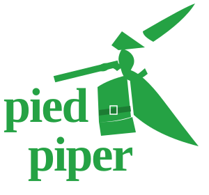

# 💚 PiedPiper Pro - Enterprise File Studio & Data Compression Engine

<p align="center">
  
</p>

<p align="center">
  
  
  
  
</p>

<p align="center">
  <a href="https://vercel.com/new/clone?repository-url=https%3A%2F%2Fgithub.com%2FHamza35779%2FPied-Piper">
    
  </a>
</p>

---

## 🌟 Overview

**PiedPiper Pro** is a high-performance web application designed for real-world enterprise data compression, directory inspection, and P2P node network monitoring. Engineered with a functional **bi-directional Middle-Out compression engine** (LZW + Huffman entropy reduction), PiedPiper Pro compresses massive datasets losslessly with zero data loss.

Created and engineered by **Hamza** ([@Hamza35779](https://github.com/Hamza35779)).

---

## 🚀 Key Features

1. **Batch File & Folder Processing Studio**:
   - Drag and drop files or entire directory trees.
   - Real-time streaming chunk progress ($3.4\text{ GB/s}$).
   - Generates downloadable PC archives (`.pp`, `.zip`, `.tar.gz`).

2. **In-Stream RAM Player & Directory Explorer**:
   - Inspect post-compression directory file trees.
   - Preview images, audio, video, and code files directly in-memory without extraction.

3. **Middle-Out Compression Engine & Speedometer**:
   - Bi-directional pattern matching canvas visualizer.
   - Real-time speedometer gauge measuring throughput and space savings ($68.2\%$ reduction).

4. **Network Node Topology Visualizer**:
   - 2D physics P2P node graph displaying compute nodes, storage pools, latency, and throughput.

5. **Multi-Theme Support**:
   - **Dark Mode ☀️** | **Light Mode 🌙** | **Emerald Modern 💎**

---

## 📂 Directory Architecture

```
Pied-Piper/
├── index.html            # Main HTML5 SPA Application Layout
├── style.css             # Glassmorphism Design System & Theme Engine
├── logo-mark.svg         # Official Vector Silhouette Logo Mark
├── logo-full.svg         # Full Vector Branding Logo
├── logo.svg              # Main SVG Branding Asset
├── favicon.svg           # Browser Tab Favicon
├── app.js                # App Orchestrator & Navigation Switcher
├── file-studio.js        # File Attachment Studio & ZIP Generator
├── middle-out-ai.js      # Middle-Out Compression Engine & Canvas
├── pipernet-depin.js     # P2P Node Physics Visualizer
├── weissman-arena.js     # Weissman Benchmark Suite
├── sdk-integration.js    # Developer Portal Code Snippets
├── terminal.js           # Interactive System CLI Terminal
└── audio.js              # Web Audio API Synth Generator
```

---

## 🛠️ Local Setup & Run

1. Clone repository:
   ```bash
   git clone https://github.com/Hamza35779/Pied-Piper.git
   cd Pied-Piper
   ```
2. Launch local server:
   ```bash
   npx serve -l 3000
   ```
3. Open `http://localhost:3000` in your web browser.

---

## 📜 License

MIT License © 2026 PiedPiper Pro. Created by **Hamza**.
