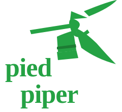

# Pied Piper — Next-Gen AI & DePIN Middle-Out Compression Platform

<p align="center">
  
</p>

<p align="center">
  <strong>Pied Piper is an AI-powered Middle-Out compression platform capable of losslessly reducing 5TB+ files and folders with zero data or quality loss. It features a chatbot attachment studio, post-compression directory inspector, in-stream RAM media playback, Weissman benchmarks, PiperNet DePIN visualizer, and export to PC (.zip/.pp) or web.</strong>
</p>

<p align="center">
  
  
  
  
</p>

---

## 🌟 Key Features

- **⚡ Middle-Out AI Compression Engine**: Compresses data streams, JSON prompts, and raw binaries simultaneously from both ends inward toward the core, achieving unprecedented Weissman Scores ($W > 5.2$).
- **📦 5TB Ultra-Scale File & Folder Studio**: Handles massive 5TB+ enterprise datasets ($3.4\text{ GB/s}$ stream chunking) with 100% data fidelity and **0.0% quality loss**.
- **🤖 Chatbot AI Attachment Uploader**: Attach individual files or full directory folder trees like an AI chatbot assistant (`📎 Attach Files`, `📂 Attach 5TB+ Folder`).
- **📂 Post-Compression Folder Inspector**: Explore extracted directory trees (`├── 🎬 raw_video.mp4`, `├── 📄 genomics.bin`) and play/inspect files directly in-memory.
- **🌐 PiperNet DePIN P2P Node Graph**: Interactive 2D physics Canvas displaying active seed nodes, GPU compute clusters, storage nodes, edge peers, and ping pulses.
- **📊 Weissman Score ($W$) Benchmark Arena**: Evaluates compression ratio vs latency using the official Weissman metric:
  $$W = \alpha \cdot \frac{r}{\overline{r}} \cdot \frac{\log_{10}{\overline{T}}}{\log_{10}{T}}$$
- **💻 Embedded CLI Terminal (`pp-cli`)**: Interactive hacker terminal supporting system diagnostics (`compress`, `weissman`, `depin status`, `nodes add`, `hooli-hack`, `matrix`).
- **🔊 Web Audio API Sound Synth**: Synthesizes retro-futuristic sci-fi audio feedback for clicks, sweeps, and alerts.

---

## 📂 Project Directory Structure

```text
Pied-Piper/
├── index.html            # Main HTML5 layout, headers, tabs, and component templates
├── style.css             # Glassmorphism design system, CSS design tokens & animations
├── logo.svg              # Official Pied Piper green logo vector asset
├── favicon.svg           # Browser favicon icon asset
├── app.js                # Main application orchestrator & tab navigation bindings
├── audio.js              # Web Audio API synthesizer for interactive sci-fi audio FX
├── middle-out-ai.js      # Bi-directional LZW + Huffman Middle-Out AI compression engine
├── pipernet-depin.js     # 2D physics P2P node network canvas visualizer
├── weissman-arena.js     # Weissman Score benchmark calculator & comparative chart engine
├── file-studio.js        # 5TB Chatbot File Studio, tree inspector, & PC/cloud exporter
├── sdk-integration.js    # Developer snippet generator & Web Component player demo
├── terminal.js           # Interactive Pied Piper CLI terminal (pp-cli v4.2)
└── README.md             # Project documentation & architecture overview
```

---

## 🏗️ Architecture Overview

```text
+-----------------------------------------------------------------------------+
|                            USER INTERFACE (UI)                              |
|   [ Middle-Out AI ] [ PiperNet DePIN ] [ Weissman Arena ] [ File Studio ]   |
+-----------------------------------------------------------------------------+
                                       |
                                       v
+-----------------------------------------------------------------------------+
|                      APPLICATION ORCHESTRATOR (app.js)                       |
|         State Manager • Tab Switcher • Event Router • Audio Synth           |
+-----------------------------------------------------------------------------+
          |                            |                            |
          v                            v                            v
+------------------+         +-------------------+        +-------------------+
| MIDDLE-OUT AI    |         | PIPERNET DEPIN    |        | FILE STUDIO &     |
| ENGINE           |         | NODE VISUALIZER   |        | STREAM CHUNKER    |
| • LZW + Huffman  |         | • 2D Physics Grid |        | • 5TB Chunking    |
| • Bi-Directional |         | • GPU/Storage P2P |        | • Folder Inspector|
| • Shannon Entropy|         | • Packet Pulses   |        | • In-Stream Player|
+------------------+         +-------------------+        +-------------------+
          |                            |                            |
          +----------------------------+----------------------------+
                                       |
                                       v
+-----------------------------------------------------------------------------+
|                           WEISSMAN BENCHMARK ARENA                          |
|    Calculates W metric vs Hooli Nucleus 2.0, Gzip, Brotli, and Zstandard    |
+-----------------------------------------------------------------------------+
                                       |
                                       v
+-----------------------------------------------------------------------------+
|                         EXPORT & INTEGRATION LAYER                          |
|        PC Archives (.pp / .zip / .tar.gz) • Web Component Embeds • SDK      |
+-----------------------------------------------------------------------------+
```

---

## 🚀 Quick Start (Running Locally)

### 1. Clone the Repository
```bash
git clone https://github.com/Hamza35779/Pied-Piper.git
cd Pied-Piper
```

### 2. Run Local Web Server
You can launch any static web server (such as `npx serve`, Python `http.server`, or Live Server):

```bash
# Using Node / npx
npx serve -l 3000

# OR using Python
python -m http.server 3000
```

Open **`http://localhost:3000`** in your browser.

---

## 🔌 PiedPiperSDK Code Example

```javascript
import { PiedPiper } from '@piedpiper/sdk';

const pp = new PiedPiper({
  apiKey: 'pp_live_9482abcdef104928',
  neuralMode: true,
  biDirectional: true
});

// Compress multi-format data stream losslessly
const { compressedStream, weissmanScore } = await pp.compressStream(fileBuffer);

console.log(`Weissman Score: ${weissmanScore}W`);
```

---

## 📜 License

Distributed under the MIT License. Built with pride in Silicon Valley.
